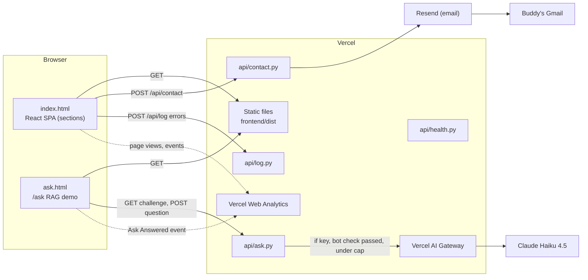

# 01 · Architecture: how the pieces fit together

## The one-paragraph version

The site is a static React app (built by Vite) plus a handful of Python serverless functions under `api/`. Both live in one GitHub repo. Vercel builds the React app into static files, turns every `api/*.py` file that doesn't start with `_` into an HTTPS endpoint, and serves both from harshithportfolio.com. GitHub Actions runs lint, build, Python unit tests and Playwright browser tests on every push; SonarCloud and Trivy scan for code quality and security. Merging to `main` deploys production.

## Diagram

## Frontend (`frontend/`)

| Piece | Where | Notes |
|---|---|---|
| Main page | `index.html` → `src/main.tsx` → `src/App.tsx` | Sections in order: Hero, About, Skills, Projects, Learning, Experience, Contact, Footer |
| `/ask` page | `ask.html` → `src/ask/main.tsx` → `AskApp.tsx` | Second Vite entry, configured in `vite.config.ts` (`rollupOptions.input`) |
| Content data | `src/data/projects.ts`, `learning.ts`, `shared.ts` | Typed arrays; `shared.ts` holds shared types and badge maps |
| Inline content | `Experience.tsx` (`EXPERIENCE`), `Skills.tsx` (`SKILL_GROUPS`) | Edit in the component file |
| Project card | `components/ProjectCard.tsx` | Shared by the Projects grid and the hero's Featured Work row (`compact` prop) |
| Previews | `components/previews/*`, registered in `ProjectPreview.tsx` | Lazy-loaded, one chunk each |
| Scroll reveal | `hooks/useScrollReveal` + CSS | The source of the "invisible sections" bug fixed in #16 |
| Bot check (client) | `src/ask/pow.ts` | Solves the proof-of-work puzzle with Web Crypto SHA-256 |
| Build-time flags | `vite.config.ts` → `__HAS_RESUME__` | Resume button renders only if `public/resume.pdf` exists |

Styling is plain CSS: one `.css` per component with component-prefixed class names, and shared utility classes and CSS custom properties (`--bg-card`, `--text`, `--accent`, `--border`) in `src/index.css`.

## Backend (`api/`)

Vercel's Python runtime runs each endpoint file as a `BaseHTTPRequestHandler` subclass named `handler`. Files starting with `_` are private modules, not endpoints.

| File | Endpoint | What it does |
|---|---|---|
| `ask.py` | `GET /api/ask` issues a bot-check challenge; `POST /api/ask` answers a question | Validates size and length, rate-limits 8/min per client, verifies the proof of work, calls `_rag.answer`, and returns JSON escaped by `_safe_json` |
| `_rag.py` | (module) | BM25 retrieval over `_knowledge.PASSAGES` with light stemming and recruiter synonyms, then Claude generation or an extractive fallback. Daily caps: `ASK_DAILY_CAP` (200) and `ASK_CLIENT_DAILY_CAP` (20) |
| `_pow.py` | (module) | HMAC-signed, client-bound, 5-minute, single-use proof-of-work tokens (16 leading zero bits by default) |
| `_knowledge.py` | (module) | The only facts `/ask` may use; mirrors site content |
| `contact.py` | `POST /api/contact` | Validates, applies a honeypot field (`website`), a 3-second minimum fill time and 5/hour per IP, then sends through Resend with the visitor as reply-to |
| `log.py` | `POST /api/log` | Hardened client error beacon (size, field and level limits) |
| `_log.py` | (module) | Structured logging to Vercel logs |
| `health.py` | `GET /api/health` | Liveness check |

Rate limits and caps live in memory, per warm instance. They reset when Vercel starts a fresh instance and are not shared between instances. That is a known, accepted trade-off; a shared counter (for example Upstash Redis) is the upgrade path if it's ever needed.

## Environment variables (set in Vercel by Buddy)

| Variable | Used by | Effect if missing |
|---|---|---|
| `RESEND_API_KEY` | `contact.py` | Form returns 503 and tells visitors to email directly |
| `CONTACT_TO_EMAIL`, `CONTACT_FROM_EMAIL` | `contact.py` (optional) | Defaults to Buddy's Gmail and `onboarding@resend.dev` |
| `AI_GATEWAY_API_KEY` (set) or `ANTHROPIC_API_KEY` | `_rag.py`, `_pow.py` | `/ask` answers extractively ("Retrieval only") |
| `ASK_MODEL`, `ASK_DAILY_CAP`, `ASK_CLIENT_DAILY_CAP`, `ASK_POW_BITS`, `ASK_CHALLENGE_SECRET` | `/ask` (optional) | Sensible defaults |

Vercel bakes env vars into a deployment when it is built. After adding or changing one, redeploy; an older preview won't see it.

## CI/CD

| Workflow / app | Runs on | Checks |
|---|---|---|
| `ci.yml` | Every push and PR | **Lint & Build** (ESLint, `tsc -b`, Vite), **API tests** (`python -m unittest discover tests`), **E2E (Playwright)** (desktop + Pixel 7) |
| `trivy.yml` | PRs, `main`, weekly | Dependency, secret and misconfiguration scan |
| SonarCloud GitHub App | Every PR and `main` | Quality gate (Automatic Analysis, config in `.sonarcloud.properties`; there is intentionally no sonar workflow) |
| Vercel GitHub App | Every push | Preview deployment; the `vercel[bot]` PR comment has the preview URL |
| `deploy-prod.yml` | Push to `main` | Lint, build, `vercel build --prod`, deploy, health check |

`JenkinsFile` and `backend/` are leftovers from an earlier self-hosted (Hetzner) setup. Production does not use them.

## Request walkthrough: a question on `/ask`

1. `ask.html` loads, and `pow.ts` immediately `GET`s `/api/ask` for a signed challenge and starts hashing in the background.
2. The visitor asks a question. The browser `POST`s `{question, proof}`.
3. `ask.py` checks the body size, question length and control characters, and the per-minute rate limit.
4. `_rag.retrieve` tokenises the question (stopwords, stemming, synonyms) and scores every passage with BM25. If nothing scores above `MIN_SCORE`, it answers "I don't have anything on that" without ever calling a model.
5. If a key exists, the proof verifies, and the daily caps allow it, `_rag.generate` sends the top passages to Claude Haiku with a system prompt that says to answer only from them, with `[n]` citations. Otherwise, or if the model errors, it returns an extractive answer with `reason` set to why (`no_match`, `no_key`, `bot_check_failed`, `daily_cap`, `model_error`).
6. The page renders the answer with clickable citations, shows "Generated by …" or "Retrieval only (reason)", and sends an "Ask Answered" analytics event.
